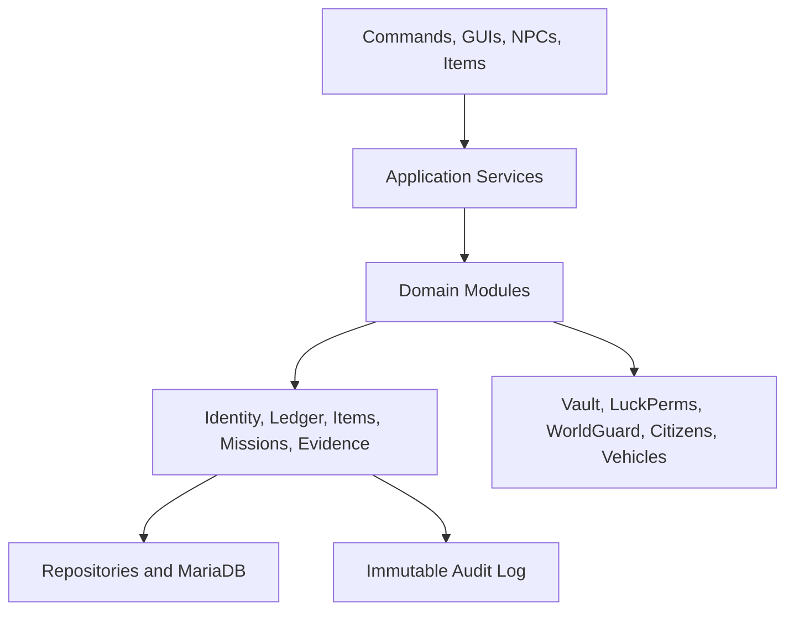
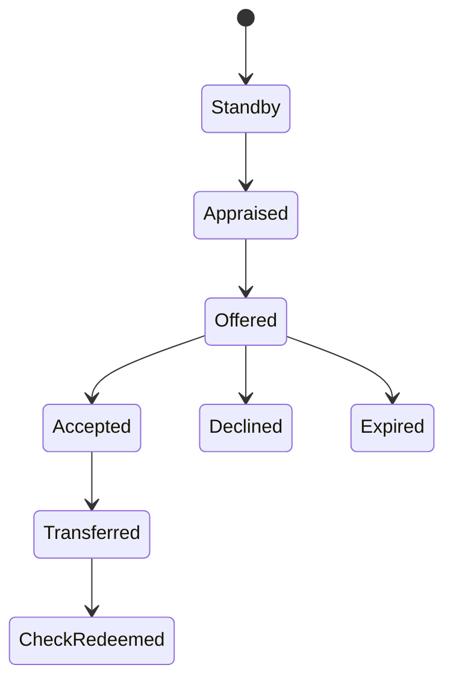

# AfterLifeRP — Codex Master Design and Implementation Plan

> This document is the source of truth for building a modular roleplay server plugin for Paper. Give this file to Codex together with the repository and instruct Codex to implement one milestone at a time. Do not attempt to build every module in a single pass.

## 1. Product Vision

AfterLifeRP is a serious city-roleplay server in which legal professions, government services, organized crime, and player-run businesses depend on one another.

The server should avoid shallow “click once, receive money” jobs. Each profession must have:

1. A repeatable legal gameplay loop.
2. A player-to-player RP responsibility.
3. A progression path and meaningful equipment.
4. A controlled connection to the criminal economy.
5. Evidence, risk, and consequences for illegal behavior.
6. Economic inputs, outputs, and sinks that prevent inflation.

The initial job set is:

- Bank employee and bank director
- Lawyer
- Police officer and K-9 officer
- Gang member and cartel member
- Electrician
- Food delivery driver
- Real-estate agent and agency director
- EMS medic
- Used-car dealership employee
- Mechanic and tow-truck operator
- Bartender, bouncer, DJ, and nightclub manager

The plugin must support Italian-facing names and command aliases, while source code, database identifiers, configuration keys, and technical documentation remain in English.

## 2. Recommended Technical Direction

### 2.1 Core Platform

- Server: Paper 1.20.6, pinned to a tested stable build.
- Java: Java 21.
- Plugin language: Java 21.
- Build: Gradle Kotlin DSL.
- Plugin name: `AfterLifeRP`.
- Root package: `com.afterlife.rp`.
- Production database: MariaDB.
- Database pool: HikariCP.
- Schema migrations: Flyway.
- Text/UI: Paper Adventure components and MiniMessage.
- Economy bridge: register the AfterLife ledger as the server's Vault economy provider. Do not run a second authoritative economy provider.
- Permissions: LuckPerms API.
- Regions: WorldGuard adapter.
- NPCs: Citizens adapter.
- Placeholders: PlaceholderAPI adapter.
- Packet-only visuals and virtual sign input: ProtocolLib adapter.
- Custom models/items: adapter interface for ItemsAdder or Oraxen; choose one before the content-production milestone.
- Vehicle system: adapter interface around the selected vehicle plugin; do not embed a specific commercial vehicle API throughout business logic.

### 2.2 Why a Custom Plugin Is the Core

This project has shared money movement, vehicle ownership, contracts, evidence, account freezes, item serial numbers, mission recovery, and police searches. Those features need:

- Atomic database transactions
- Idempotency
- Restart recovery
- Central permissions
- Auditable state changes
- Stable APIs between jobs
- Automated testing

Skript may be retained for temporary prototypes or one-off staff events, but it must not own authoritative balances, vehicle ownership, property ownership, evidence, contracts, or item validity.

### 2.3 Technical Reality Checks

- A vanilla scoreboard cannot display an animated GIF. Use a static custom resource-pack glyph or logo in the sidebar. A genuinely animated image requires a client mod or a different visual implementation.
- Item lore is presentation, not security. Authoritative item identity must use Paper Persistent Data Container data and a server-side database record.
- MD5 is not suitable for secure signatures. Use HMAC-SHA256 with a secret stored outside source control.
- Never access MariaDB synchronously from the Minecraft main thread.
- Do not use NMS or reflection unless a reviewed integration makes it unavoidable.

## 3. Non-Negotiable Engineering Rules

Codex must preserve these rules in every milestone:

1. All database access runs asynchronously.
2. All Bukkit world, entity, inventory, and GUI mutations return to the server thread.
3. Every money movement uses the shared ledger service.
4. Every transaction has a unique idempotency key.
5. Physical valuables use unique serial numbers and server-side status records.
6. GUI titles and item names are never used as authoritative identifiers.
7. Every GUI uses a custom `InventoryHolder` or session identifier.
8. Every long-running action is a persisted state machine.
9. Every privileged action writes an immutable audit record.
10. Every module can be disabled independently in configuration.
11. All prices, cooldowns, chances, coordinates, messages, and item definitions are configurable.
12. Secrets, database credentials, and signature keys never enter Git.
13. A restart must not duplicate rewards, lose accepted missions, or repeat a completed transfer.
14. Commands validate sender type, permissions, arguments, state, and cooldowns.
15. Never trust client-provided text, item lore, display names, or GUI clicks without server-side validation.

## 4. System Architecture



### 4.1 Layer Responsibilities

| Layer | Responsibility |
|---|---|
| Presentation | Commands, inventory GUIs, action bars, boss bars, NPC interactions, and player messages |
| Application | Validates use cases, opens transactions, calls domain services, and returns results |
| Domain | Job rules, mission state machines, contracts, ownership, medical treatment, and crime rules |
| Infrastructure | SQL repositories, configuration, scheduling, external-plugin adapters, and caching |
| Audit | Append-only records for money, items, staff actions, searches, seizures, and ownership changes |

### 4.2 Shared Services

- `IdentityService`: permanent player ID, nickname, job identity, and player lookup.
- `PermissionService`: LuckPerms-backed authorization.
- `AccountService`: personal and organization accounts.
- `LedgerService`: double-entry clean-money transactions.
- `DirtyMoneyService`: signed physical dirty-money notes and confiscation.
- `ItemRegistryService`: serialized custom items and validity checks.
- `ContractService`: contract creation, signatures, validation, and immutable snapshots.
- `LicenseService`: professional and government-issued licenses.
- `PropertyService`: property state, ownership, leases, keys, and upgrades.
- `VehicleService`: vehicle ownership, state, modifications, storage, and impound.
- `MissionService`: mission assignment, progress, timeout, and recovery.
- `RegionService`: named POIs and WorldGuard region checks.
- `EvidenceService`: evidence creation, chain of custody, warrants, and access logs.
- `NotificationService`: chat, action bar, boss bar, title, and staff alerts.
- `AuditService`: append-only security and administrative records.
- `CooldownService`: persistent cooldowns where restart bypass would matter.

## 5. Repository Layout

```text
afterlife-rp/
├── AGENTS.md
├── README.md
├── build.gradle.kts
├── settings.gradle.kts
├── docker-compose.dev.yml
├── docs/
│   ├── architecture.md
│   ├── admin-setup.md
│   ├── economy-model.md
│   ├── permissions.md
│   ├── commands.md
│   ├── item-catalog.md
│   └── module-acceptance-tests.md
├── src/main/java/com/afterlife/rp/
│   ├── AfterLifeRPPlugin.java
│   ├── bootstrap/
│   ├── config/
│   ├── database/
│   ├── audit/
│   ├── integration/
│   ├── shared/
│   │   ├── identity/
│   │   ├── economy/
│   │   ├── items/
│   │   ├── contracts/
│   │   ├── licenses/
│   │   ├── missions/
│   │   ├── regions/
│   │   └── gui/
│   └── module/
│       ├── banking/
│       ├── legal/
│       ├── police/
│       ├── crime/
│       ├── electrician/
│       ├── delivery/
│       ├── realestate/
│       ├── ems/
│       ├── vehicles/
│       ├── mechanic/
│       ├── usedcars/
│       └── nightclub/
├── src/main/resources/
│   ├── paper-plugin.yml
│   ├── config.yml
│   ├── messages_it.yml
│   ├── items.yml
│   ├── economy.yml
│   ├── modules/
│   └── db/migration/
└── src/test/java/com/afterlife/rp/
    ├── unit/
    ├── integration/
    └── fixtures/
```

## 6. Data Model

Use UUIDs as internal identifiers. Public sequential IDs are display identifiers only.

### 6.1 Core Tables

| Table | Purpose and important constraints |
|---|---|
| `players` | UUID, permanent public ID, first/last seen, nickname, locale; unique public ID |
| `organizations` | Government departments, businesses, gangs, and cartel factions |
| `organization_members` | Membership, role, join/leave timestamps |
| `accounts` | Player or organization clean-money accounts and frozen state |
| `ledger_transactions` | One logical transfer, status, reason, actor, idempotency key |
| `ledger_entries` | Debit/credit entries; transaction must balance to zero |
| `serialized_items` | Item serial, type, owner if applicable, status, issue time |
| `dirty_notes` | Dirty-money serial, denomination, signature metadata, status |
| `audit_events` | Append-only actor, action, target, structured context, timestamp |
| `job_sessions` | On-duty state, job, start/end, active vehicle |
| `missions` | Type, owner, state, POI, deadline, reward snapshot, version |
| `points_of_interest` | Admin-defined named locations and region references |
| `cooldowns` | Durable cooldown key, subject, expiration |

### 6.2 Civic and Legal Tables

| Table | Purpose |
|---|---|
| `licenses` | Medical, firearm, driver, law degree, business, and professional licenses |
| `contracts` | Contract type, immutable content snapshot, state, created time |
| `contract_parties` | Signer role, UUID, signature time |
| `criminal_records` | Charges, severity, status, sentence, evidence links |
| `legal_cases` | Civil and criminal cases, assigned lawyer/judge, state |
| `case_evidence` | Evidence references and chain of custody |
| `warrants` | Search/arrest authority, issuer, target, expiration, scope |
| `bail_records` | Bail offers, payment, release conditions |

### 6.3 Property and Vehicle Tables

| Table | Purpose |
|---|---|
| `properties` | Property ID, type, region, legal/dirty state, availability |
| `property_ownership` | Owner/tenant relationship and effective dates |
| `property_keys` | Serialized keys, lock version, owner, revoked state |
| `property_upgrades` | Chest limit, furnishing license, and other upgrades |
| `black_property_files` | Physical evidence record for illegal rentals |
| `power_anomalies` | Illegal utility consumption and police alert state |
| `vehicles` | External vehicle ID, VIN, model, owner, state, garage |
| `vehicle_modifications` | Installed upgrade, price snapshot, installer |
| `vehicle_storage` | Trunk/secret-compartment data references |
| `vehicle_sales` | Seller, dealer, price, contract, check, state |
| `impounds` | Reason, authority, fee, tow operator, release state |

### 6.4 Medical, Business, and Crime Tables

| Table | Purpose |
|---|---|
| `injuries` | Player injury type, severity, cause, state |
| `treatments` | Medic, patient, medicine/tool, step, timestamp |
| `medicine_batches` | Producer, recipe, batch number, legality, status |
| `medical_certificates` | Patient, medic, checks completed, issue/expiry |
| `business_orders` | POS order lines, customer, employee, total, state |
| `receipts` | Serialized receipt linked to the ledger transaction |
| `inventory_orders` | Business supply orders and delivery time |
| `escrow_deals` | Two-sided deposits, bartender, commission, state |
| `bounties` | Target, anonymous sponsor reference, escrow amount, state |
| `contraband_packages` | Courier, route, contents category, status |
| `drug_batches` | Producer/source, drug type, batch, status |
| `police_alerts` | Alert type, approximate location, source, response state |

### 6.5 Optimistic Concurrency

Mutable records such as missions, escrow trades, properties, vehicles, and accounts must have a `version` column. Updates use:

```sql
UPDATE ... SET version = version + 1
WHERE id = ? AND version = ?;
```

If zero rows are updated, the operation lost a race and must fail safely instead of repeating rewards.

## 7. Economy Design

### 7.1 Currency Types

1. **Clean money:** Digital balance represented through the shared ledger and exposed to other plugins through Vault.
2. **Dirty money:** Serialized physical notes. It cannot be deposited into ordinary accounts until laundered through a future laundering mechanic.
3. **Organization treasuries:** Separate digital accounts for the hospital, police, real-estate agency, nightclub, dealership, and other organizations.
4. **Checks:** Serialized, single-redemption payment instruments linked to a specific payee and transaction.

### 7.2 Double-Entry Ledger

Every clean-money operation has balanced entries. Examples:

- ATM withdrawal: player digital account debit; cash-issuance clearing account credit.
- Hospital bill: patient debit; hospital treasury credit; optional commission paid in the same transaction.
- Vehicle purchase: dealership treasury debit; seller payable/check-clearing credit.
- Civil judgment: debtor debit; client credit; lawyer fee credit.

Balances are derived from ledger entries or maintained in a transactionally consistent cached balance table. Never update balances with unrelated standalone queries.

The AfterLife ledger is the source of truth and registers a Vault economy provider. EssentialsX may still provide unrelated utility commands, but its standalone economy must not be enabled as a competing balance store.

### 7.3 Physical Note Security

Every note contains PDC values:

- `afterlife:item_type=dirty_money` or `banknote`
- `afterlife:serial=<UUID>`
- `afterlife:denomination=<integer>`
- `afterlife:issued_at=<epoch>`
- `afterlife:signature=<HMAC-SHA256>`

The database tracks `ISSUED`, `REDEEMED`, `CONFISCATED`, or `VOID`. A copied item has the same serial and cannot be redeemed twice.

### 7.4 Transaction Workflow

1. Validate permissions, account state, amount, inventory capacity, and target.
2. Create an idempotency key.
3. Begin a SQL transaction.
4. Lock relevant account/item rows.
5. Write ledger entries and serialized-item records.
6. Commit.
7. Deliver or remove in-game items on the server thread.
8. If item delivery fails, create a durable pending-delivery record instead of reversing blindly.
9. Audit the result.

### 7.5 Inflation Controls

- Legal jobs should mostly move money from government/business budgets, not create unlimited currency.
- Government job budgets refill according to configurable server policy.
- Hospital medicines have high reagent costs and low margins.
- Businesses pay wholesale supply costs.
- Property, licenses, impound fees, repairs, and vehicle upgrades are money sinks.
- Employee commission is separated from organization revenue.
- Dirty money requires risky laundering and loses a configured percentage.
- Track daily source/sink reports by category before adjusting rewards.

## 8. Identity, Nametags, and Sidebar

### 8.1 Permanent Player ID

- On first join, allocate the next sequential public ID in a database transaction.
- `/id` shows the player’s permanent ID.
- Standard nametag: `[#12]`.
- VIP nametag: `[#12] (Alex)`.
- `/setnick <text>` requires `afterlife.vip.nickname`.
- Nickname length: 1–10 visible characters.
- `/setnick reset` and `/setnick off` remove it.
- Strip MiniMessage tags, control characters, and misleading Unicode.
- Losing permission automatically removes the visible nickname.

### 8.2 Sidebar

Update only changed lines to prevent flicker. Show:

- Static resource-pack server mark
- Public ID
- LuckPerms primary group
- Clean-money balance
- Online/max players
- Server address

Clear the sidebar on quit and plugin disable. Do not create one repeating scheduler per player; use one controlled update service or scheduler abstraction.

## 9. Module Specifications

## 9.1 Banking

### Player Features

- Generate a unique IBAN at first account creation.
- `/iban`: show IBAN, clean balance, debt, and frozen status.
- `/atm` and `/banca`: require a valid serialized credit card.
- Deposit valid physical banknotes.
- Withdraw quick denominations or a custom positive integer amount.
- Transfer by IBAN or exact player identity.
- Display the last five transactions.

### Employee Features

- `/banchiere <player>` requires `afterlife.bank.banker`.
- Open an account.
- Issue or revoke a serialized credit card.
- Print a signed written-book statement.
- Manage approved loans in a later sub-milestone.

### Director Features

- `/sequestro <player>` requires `afterlife.bank.director`.
- Freeze or unfreeze an account with a mandatory reason.
- Frozen accounts cannot withdraw, transfer, or use normal ATM functions.
- Legal seizure deposits must use a dedicated evidence/seizure account.

### Acceptance Rules

- Reject self-transfer, invalid amount, insufficient funds, unknown target, frozen account, and repeated request.
- Validate card ownership and revocation state.
- Never rely on a five-entry history string as the authoritative ledger; the GUI may query the latest five records.

## 9.2 Lawyer and Legal System

### Binding Contracts

- Two parties create and sign a Book and Quill.
- The lawyer uses `/valida_contratto`.
- Store an immutable text snapshot and SHA-256 content hash.
- Convert the item into an enchanted-looking validated contract.
- Record lawyer, parties, timestamps, and contract type.

### Police-Station Defense

- Lawyers can enter the interrogation room through region permissions.
- A detention timer records arrest time and allowed duration.
- Before extended imprisonment, the suspect must be offered a lawyer call.
- Lawyers may negotiate bail or sentence reduction through a structured case GUI.

### Criminal Record Rehabilitation

- `/pulisci_fedina <player>` checks:
  - Sentence completed
  - Only eligible minor offenses
  - Configured crime-free period
  - Lawyer permission and fee payment
- The action archives eligible offenses; it does not physically delete audit history.

### Civil Lawsuits

- `/causa_civile` creates a case with claimant, defendant, amount, reason, and supporting contract/evidence.
- A judge approves or rejects the case. Automated judgment must be disabled by default.
- Approved compensation uses the ledger and supports insufficient-funds debt rather than creating money.

### Access to Evidence and Appeals

- Evidence access requires lawyer assignment and case authorization.
- `/ricorso` validates procedural violations such as expired detention or missing warrant.
- Immediate release is allowed only when an explicit, machine-verifiable rule is violated.
- Every evidence read and appeal is audited.

### Illegal Shell Licenses

- A corrupt lawyer can create a fraudulent business cover.
- Police financial checks may show the cover profile until evidence exposes it.
- Never erase the real audit trail; store the fraud as a deception layer.

## 9.3 Police, Evidence, and K-9

- Arrests create a case and detention record.
- Searches require consent, exigent conditions, or an active warrant.
- Confiscated items receive evidence IDs and chain-of-custody entries.
- `/controlloconto <player>` returns only information the officer is authorized to see.
- K-9 scans run at a controlled interval and only for deployed, on-duty units.
- K-9 detects configured contraband tags within five blocks.
- Odor-proof containers may defeat ordinary K-9 scans, subject to balance rules.
- Secret vehicle compartments require either K-9 indication or a specific inspection test.
- Police alerts reveal an approximate region unless exact coordinates are justified.

## 9.4 Drugs, Gang Sales, and Trips

### Sales

- On-duty gang members periodically receive NPC demand requests in configured street-sale zones.
- NPCs pay in dirty money and below cartel wholesale prices.
- Police patrol routes overlap sales zones.
- Transactions create subtle evidence or suspicion rather than guaranteed detection.

### Consumption

- Default result chances: 70% good trip, 30% bad trip.
- Effects are configurable per drug.
- Hallucination entities are packet-only and visible only to the consuming player.
- Good trips show short comedic scenes.
- Bad trips show short frightening hostile mobs without causing real damage.
- Add cooldowns and caps to prevent packet/entity spam.

## 9.5 Electrician

### Legal Dispatch

- Admins register electrical cabinets, traffic lights, and repeaters as POIs.
- The dispatch service periodically changes an eligible POI to `FAILED`.
- An on-duty electrician accepts the call from a service-vehicle terminal.
- Compass/action-bar guidance points to the failure.
- The repair requires a Tool Kit and a timed wiring/frequency GUI minigame.
- Success restores the POI and pays from the municipal maintenance budget.

### Reward Formula

```text
Government pay =
callout fee + (failure complexity × multiplier) + time bonus
```

### Rare Circuit Board

- Each valid repair/dismantling completion performs one server-side 1% roll.
- A successful roll issues a serialized `Intact Circuit Board` with custom model data `2004`.
- The event receives a discreet audit entry.
- Never calculate the rare roll from repeated GUI clicks.
- The circuit board is a key ingredient for an ATM hacking device.

## 9.6 Food Delivery

### Shift and Orders

- `/job` or NPC interaction begins a delivery shift.
- Issue uniform and spawn/link a company scooter through the vehicle adapter.
- Choose only registered NPC restaurant and customer POIs.
- Create one serialized order package with order ID, driver, pickup time, and destination.
- Prevent dropping, storing, trading, or moving the package into unsupported inventories.

### Navigation and Delivery

- Update distance periodically through the action bar.
- Complete delivery by right-clicking the assigned NPC/mailbox within three blocks.
- Reward uses base pay, route distance, and speed/temperature bonus.
- A lack of X/Z movement triggers warnings and eventually cancels the order.

### Temperature

```text
T(t) = max(0, 100 - coolingRate × elapsedSeconds)
Tip = baseTip × (T(t) / 100) × routeMultiplier
```

Use server timestamps rather than decrementing a value every tick.

### Sealed Contraband Package

- After a legal delivery, run one configured chance, initially 15%.
- Spawn a shady NPC or send an anonymous RP-phone message near the previous delivery.
- The player can accept or decline.
- The sealed package cannot be opened through ordinary interaction.
- Delivery goes to a nearby shadow POI and pays dirty money.
- Police/K-9 can detect its contraband classification.

## 9.7 Real Estate

### Legal Properties

- `/luoghidisponibili` lists available houses and apartments.
- A sale creates ownership, payment, and a serialized key.
- Each property has a lock version.
- `/cambia_serratura` increments the lock version, revoking all earlier keys.
- Only authorized agents can change locks, with an eviction/sale reason.
- Property upgrades include chest limits and VIP furnishing licenses.

### Illegal Rentals

- `/luoghisporchi` lists staff-configured illegal properties.
- Payment is dirty money.
- No official lease is created in the police-facing registry.
- A `Confidential File #[Property_ID]` is created in the agency’s physical evidence safe.
- Destroying the file removes future collection rights and clears the illegal occupants, but leaves an audit event.

### Abnormal Power Consumption

- Track weighted interactions such as opening storage, using workstations, or leaving configured lights active.
- Hourly risk depends on accumulated consumption and absence of a legal utility contract.
- A triggered police alert includes building ID and district, not the owner identity.

### Black Safe

- Illegal agency revenue is deposited automatically into a physical black safe.
- Only the agency director can withdraw it.
- Players cannot manually insert funds.
- Withdrawals issue serialized dirty money and are audited.

## 9.8 EMS and Hospital

### Injury Engine

- Damage causes configurable injury chances based on cause and severity.
- Initial injuries: bleeding, cuts, fracture, leg pain, embedded projectile, and unconsciousness.
- Injuries apply appropriate effects without making normal play unbearable.
- The Medical Scanner reveals authorized diagnostic information.
- Treatment is a multi-step state machine.
- Each step sends RP narration to medic and patient.

### Tools

- Forceps: remove projectiles and progress bleeding treatment.
- Bandage: stop bleeding or close cuts.
- Splint: treat fractures.
- Medical Kit: advanced multi-use treatment.
- Defibrillator: revive eligible incapacitated players.
- Adrenaline: controlled medicine with a traceable batch.

### Medicine Batches

- Every crafted medicine has a serialized batch such as `DrRossi-045`.
- Store producer, ingredients, workstation, and time in the database.
- Police can trace confiscated medicine through evidence procedures.

### Hospital Economy

- Patient payments go to the Hospital Treasury.
- The active medic receives a configured commission, such as 10%.
- Reagents create high production costs and low profit margins.
- On-duty medics receive a fixed hourly salary from the hospital/government budget.

### NPC Emergencies

- Every configured 30–40 minute interval, create an NPC emergency if enough medics are on duty.
- The medic transports the NPC by ambulance and completes treatment.
- The mission must clean up NPCs and vehicles after failure, timeout, restart, or disconnect.

### Medical Certificates

- Issue a signed and dated physical certificate only after recorded RP checks.
- Certificates may be prerequisites for driver and firearm licenses.
- The in-game `AfterLifeEMS` manual explains medical items, treatments, and certificate RP procedures without listing commands.

### Illegal Chemical Collection

- Toxic barrels exist only in configured unsafe zones.
- A medic uses an Extraction Syringe and remains within three blocks for 45–60 seconds.
- Movement, incapacitation, or disconnect cancels extraction.
- Visible green smoke reveals the activity.
- Extracted chemicals can be converted into illegal Adrenaline at a controlled workstation.
- A medic convicted of gang collaboration can permanently lose medical certification through an authorized staff/legal process.

## 9.9 Vehicles, Mechanic, and Impound

### Vehicle Abstraction

The core plugin stores ownership, VIN, state, upgrades, and storage references. The external vehicle adapter handles spawn, despawn, movement, fuel, health, towing, and visual customization.

### Repairs

- Damaged vehicles show smoke and performance loss through the adapter.
- Repairs require a workshop lift, tools, oil, and parts.
- Each repair step restores a configured amount of vehicle health.
- No instant full repair.

### Tuning

- Only mechanics can open the modification GUI while the vehicle is positioned in an authorized workshop bay.
- Show compatible modifications, current level, effect, and price.
- Initial categories: paint, neon, spoiler, engine, brakes, and storage.
- Store the exact paid price and installer for later appraisal.

### Towing and Impound

- Tow trucks attach disabled, fuel-empty, illegally parked, or seized vehicles.
- Police-created impound orders identify legal authority and reason.
- Release requires payment of an impound fee.
- Split the fee between the state/garage and the towing mechanic according to configuration.

### Secret Compartment

- A willing corrupt mechanic can install a serialized false-bottom upgrade.
- It creates a separate hidden storage inventory.
- Ordinary searches reveal only the normal trunk.
- K-9 indication or a specialized authorized inspection can expose it.
- Configure which containers/items are forbidden inside the compartment.

## 9.10 Used-Car Dealership

### Sale Workflow

1. Owner uses a serialized `Transfer of Ownership` item inside the dealership region.
2. Vehicle enters `SALE_STANDBY`; it cannot be driven, stored, modified, or transferred elsewhere.
3. Employee uses `Inspect Vehicle`.
4. Appraisal reads base model value and every installed modification from authoritative data.
5. Employee negotiates a purchase price and fills a contract with vehicle, seller, buyer, modifications, and price.
6. `/dai contratto` sends the confirmation GUI to the seller.
7. Green accepts; red declines.
8. Acceptance atomically transfers the vehicle to the dealership garage and issues a payee-specific check.
9. The seller redeems the signed contract and check at City Hall.

### Security

- Confirm the seller still owns the vehicle at acceptance time.
- Lock the vehicle row during transfer.
- Checks are single-use, payee-specific, expiring serialized items.
- Cancelled or expired contracts return the vehicle to normal state.

## 9.11 Nightclub

### POS

- Bartender selects a customer within five blocks.
- Bartender composes an order from configured products.
- Customer receives an accept/decline prompt.
- Acceptance charges the customer, credits the nightclub, pays commission, and delivers products in one use case.
- Both parties receive a serialized receipt linked to the ledger transaction.

### Mixology

- Drinks require stocked ingredients and a Shaker Station.
- Timing minigame produces `MASTERWORK`, `NORMAL`, or `DILUTED` quality.
- Example drinks:
  - Vodka Red Bull: Speed II for 3 seconds.
  - Pure Absinthe: Night Vision for 1 minute plus mild Nausea.
  - Tequila Boom Boom: Resistance I for 5 seconds.
  - Lemonade: removes configured intoxication effects.
- Buffs require cooldowns and cannot stack into unintended combat advantages.

### VIP Security and Bouncers

- VIP access is controlled by role, ticket, or bartender approval.
- Drawing configured weapons in the VIP region is blocked.
- Bouncer scanner checks configured weapon item types.
- Head of Security manages the blacklist.
- Blacklisted players receive a safe pushback and warning at the boundary.

### DJ Controls

- GUI selects approved tracks.
- DJ can enable configured fluorescent lighting and smoke effects.
- Particle and block-change rates have strict performance limits.

### Criminal Escrow

- Gang A deposits goods into Safe 1.
- Gang B deposits dirty money into Safe 2.
- Only the assigned bartender sees both manifests.
- Confirmation atomically swaps ownership and pays the configured commission.
- Either side can cancel before both deposits are locked.
- Timeout returns deposits through durable pending-delivery records.

### Bounties

- Only authorized faction leaders can create an anonymous bounty.
- Funds are escrowed at creation.
- Staff policy defines permitted targets and completion evidence.
- The bartender intermediary receives a configurable fee.
- The system retains an internal audit trail even though the sponsor is hidden from ordinary players.

### Manager Dashboard

- Employee hiring, firing, roles, and commission.
- Wholesale supply ordering with delayed delivery.
- Retail price configuration within staff-set limits.
- Staff-controlled Happy Hour: 20% discount for 30 real minutes.

## 10. Permissions and Command Policy

Use a consistent `afterlife.<module>.<action>` namespace. Italian aliases may call the same command handler.

| Permission | Purpose |
|---|---|
| `afterlife.bank.user` | ATM, IBAN, and transfers |
| `afterlife.bank.banker` | Account and card management |
| `afterlife.bank.director` | Account freezes and bank administration |
| `afterlife.legal.lawyer` | Contracts, cases, records, appeals |
| `afterlife.police.officer` | Police tools and authorized searches |
| `afterlife.police.k9` | Deploy and use K-9 |
| `afterlife.electrician.worker` | Electrician missions |
| `afterlife.delivery.driver` | Delivery shifts |
| `afterlife.realestate.agent` | Legal property actions |
| `afterlife.realestate.director` | Dirty properties and black safe |
| `afterlife.ems.medic` | Diagnosis, treatment, certificates |
| `afterlife.mechanic.worker` | Repairs, tuning, towing |
| `afterlife.usedcars.employee` | Appraisal and purchase contracts |
| `afterlife.nightclub.bartender` | POS, mixology, escrow |
| `afterlife.nightclub.security` | Scanner and blacklist enforcement |
| `afterlife.nightclub.manager` | Business dashboard |
| `afterlife.vip.nickname` | Custom short nametag |
| `afterlife.admin` | Administrative tools; never grant through normal job ranks |

Commands that change ownership, seize property, freeze accounts, clear records, issue licenses, or move large sums require:

- Explicit permission
- A reason
- Target confirmation
- Audit entry
- Optional second confirmation for high-risk actions

## 11. Configuration Design

Keep separate module files. Each file includes:

- `enabled`
- Permissions
- Prices and commissions
- Durations and cooldowns
- Probabilities
- Required item types
- POI/region types
- Messages
- Limits
- Economy source/sink accounts

Example:

```yaml
delivery:
  enabled: true
  package-timeout-seconds: 600
  afk-warning-seconds: 45
  afk-cancel-seconds: 90
  contraband-offer-chance: 0.15
  base-pay: 50
  distance-multiplier: 0.18
  temperature:
    base: 100
    default-cooling-rate: 0.12
```

Validate configuration at startup and fail the affected module with a clear error rather than silently using dangerous defaults.

## 12. Administrative Setup Tools

Do not hardcode world coordinates. Provide staff setup commands or a setup GUI to:

- Create and edit POIs.
- Bind WorldGuard regions.
- Register hospital workstations.
- Register ATMs and bank terminals.
- Register electrical cabinets and repeaters.
- Register restaurants, delivery destinations, and shadow drop points.
- Register properties, doors, black safes, and utility meters.
- Register workshop lifts, impound bays, and dealership garages.
- Register nightclub safes, POS terminals, DJ booth, VIP doors, and supply storage.
- Validate missing or overlapping configuration.
- Export a human-readable setup report.

All setup changes require `afterlife.admin.setup` and are audited.

## 13. State Machines

Long-running workflows use explicit states.

### Example: Used-Car Sale



### Required State Machines

- ATM withdrawal and pending item delivery
- Bank transfer
- Contract signature and validation
- Arrest, detention, lawyer call, bail, and release
- Electrician dispatch and repair
- Food delivery and contraband offer
- Property sale and lock replacement
- Illegal property file lifecycle
- EMS injury and treatment
- Toxic extraction
- Vehicle repair and impound
- Used-car sale
- Nightclub POS order
- Criminal escrow
- Bounty lifecycle

Each transition defines:

- Allowed previous state
- Actor and permission
- Validation
- Database writes
- In-game side effects
- Audit event
- Recovery behavior

## 14. Security and Exploit Checklist

### Items

- PDC type and serial validation
- Database status validation
- HMAC verification for financial instruments
- No reliance on name/lore
- Block crafting, anvils, grindstones, bundles, unsupported storage, and item merging where relevant
- Prevent stack sizes above one for unique serialized items

### GUIs

- Custom holder/session
- Cancel shift-click, hotbar swap, drag, double-click, and collect-to-cursor
- Revalidate permission and state on every click
- Expire sessions
- Never infer price or target from item lore

### Money

- Positive integer minor units; store cents as `BIGINT`
- No floating-point currency
- Idempotency key on every use case
- Row locks for balance-affecting operations
- Balanced ledger entries
- Daily reconciliation task

### Missions

- One active mission of a given type per player
- Persist accepted mission
- Validate exact target and proximity
- One reward transition
- Cleanup on timeout, quit, death, and restart

### Staff and Police

- Audit privileged reads as well as writes
- Reasons for freezes, seizures, record changes, and searches
- No silent deletion of evidence
- Chain of custody for confiscated items

## 15. Testing Strategy

### Unit Tests

- Reward and tip formulas
- IBAN and public ID generation
- HMAC signing and verification
- Ledger balance invariants
- Permission policies
- State-machine transitions
- Vehicle appraisal
- Temperature decay
- Injury/treatment compatibility
- Power-anomaly probability inputs

### Database Integration Tests

Run against disposable MariaDB:

- Concurrent transfer from one account cannot overspend.
- Same idempotency key creates one transaction.
- Same note/check serial redeems once.
- Used-car acceptance transfers ownership once.
- Escrow timeout returns each deposit once.
- Restart recovery completes pending delivery without duplication.
- Public IDs and IBANs remain unique under concurrency.

### Server Integration Tests

Use MockBukkit where practical and a real Paper test server for:

- Inventory click exploits
- PDC persistence
- GUI close/reopen behavior
- WorldGuard region checks
- Citizens NPC lifecycle
- Vehicle adapter behavior
- ProtocolLib packet-only hallucinations and sign input
- Plugin disable/reload cleanup

### Manual Abuse Tests

For every feature, test:

- Disconnect mid-action
- Death mid-action
- Server restart mid-action
- Full inventory
- Double click
- Two players acting simultaneously
- Permission removed while GUI is open
- Target goes offline
- Target changes ownership/state before confirmation
- Database temporarily unavailable

## 16. Observability and Operations

- Structured logs with transaction/mission IDs.
- `/afterlife health` reports database and adapter status.
- `/afterlife audit <subject>` provides authorized staff lookup.
- `/afterlife reconcile` checks ledger and serialized items.
- Metrics: active missions, transaction counts, failures, GUI sessions, DB latency, job earnings, currency sources/sinks.
- Daily economy report by module.
- Automated MariaDB backups with tested restore instructions.
- Graceful degradation: if the database is unavailable, block authoritative writes and show a clear maintenance message.

## 17. Milestone Plan for Codex

Codex must complete and verify one milestone before beginning the next.

### Milestone 0 — Repository and Decisions

- Create Gradle Paper project.
- Add `AGENTS.md` with the non-negotiable engineering rules.
- Add architecture records for selected custom-item and vehicle plugins.
- Create development MariaDB Compose file.
- Add CI for build, tests, and formatting.
- Deliver a bootable plugin with `/afterlife version` and `/afterlife health`.

**Exit gate:** Clean build, test server starts, migrations run, and missing integrations are reported clearly.

### Milestone 1 — Shared Foundation

- Configuration and localization.
- Database pool and migrations.
- Repository and transaction abstractions.
- Audit service.
- Identity/public ID.
- LuckPerms, Vault, PlaceholderAPI, WorldGuard, Citizens adapters.
- Shared GUI framework.
- PDC serialized-item framework.
- POI administration.

**Exit gate:** Identity persists; GUI exploit test suite passes; POIs survive restart.

### Milestone 2 — Economy and Banking

- Double-entry ledger.
- Vault economy bridge.
- Personal and organization accounts.
- Physical notes, dirty money, checks, and cards.
- IBAN, ATM, transfer, statement, and account freeze.
- Reconciliation and pending-delivery recovery.

**Exit gate:** Concurrency, replay, full-inventory, and restart tests pass.

### Milestone 3 — Civic, Contracts, and Property

- Licenses and certificates foundation.
- Contract signing and lawyer validation.
- Criminal records, evidence access, and detention timers.
- Legal property sales, keys, lock versions, and upgrades.
- Dirty property rentals, black files, black safe, and power anomalies.

**Exit gate:** Ownership and lock changes are atomic; destroyed evidence remains in audit history; unauthorized police/lawyer actions fail.

### Milestone 4 — Vehicles, Mechanic, Used Cars

- Vehicle adapter contract.
- Ownership, VIN, garages, modifications, and storage.
- Repairs, tuning, towing, impound, and secret compartments.
- Used-car appraisal, contract, transfer, check, and City Hall redemption.

**Exit gate:** Vehicle state remains correct through restart and concurrent sale attempts.

### Milestone 5 — Dispatch Jobs

- Shared mission and navigation framework.
- Electrician failures, repair minigame, payment, and rare circuit board.
- Food delivery, temperature, tips, company scooter, anti-AFK, and sealed package.

**Exit gate:** Missions cannot reward twice; disconnect/restart cleanup succeeds.

### Milestone 6 — EMS

- Injury engine and incapacitation.
- Medical scanner, tools, treatment steps, and narration.
- Medicine crafting, batch tracking, and hospital economy.
- NPC emergencies.
- Medical certificates and AfterLifeEMS manual.
- Toxic extraction and illegal Adrenaline path.

**Exit gate:** Treatments require correct sequence; batches trace correctly; illegal extraction cancels safely.

### Milestone 7 — Nightclub

- POS, receipts, commissions, and business inventory.
- Shaker Station and quality minigame.
- VIP controls, bouncer scanner, blacklist, DJ effects.
- Criminal escrow, bounties, and manager dashboard.

**Exit gate:** POS and escrow are atomic; inventory click abuse cannot extract or duplicate deposits.

### Milestone 8 — Police, Crime, and Cross-Module RP

- Warrants, searches, seizures, chain of custody, and K-9.
- Gang NPC drug requests and dirty-money payouts.
- Player-only good/bad trip hallucinations.
- ATM hacking recipe and attempt state machine.
- Cross-module evidence links.

**Exit gate:** Police access requires authority; contraband detection respects containers and compartments; hallucinations affect only the consumer.

### Milestone 9 — Balance, Content, and Launch Hardening

- Tune prices, timers, rewards, drop rates, and commissions.
- Populate Italian messages and item catalog.
- Build staff setup guide and player manuals.
- Perform load test and TPS profiling.
- Run exploit test matrix.
- Backup/restore rehearsal.
- Closed alpha, reset test data, then controlled beta.

**Exit gate:** No critical economy or duplication defects; all required POIs configured; staff can operate every workflow.

## 18. Codex Execution Protocol

For each milestone, Codex must:

1. Read `AGENTS.md`, this plan, and existing architecture records.
2. Inspect current code and tests before changing files.
3. Write a short implementation plan scoped only to the active milestone.
4. List assumptions and unresolved integration choices.
5. Implement vertical slices, not empty class scaffolding.
6. Add migrations and repositories in the same change as the feature that needs them.
7. Add automated tests for success, denial, concurrency, and recovery paths.
8. Run formatting, compilation, unit tests, and integration tests.
9. Start a Paper test server when the milestone touches Bukkit behavior.
10. Update documentation and the milestone checklist.
11. Report changed files, commands run, test results, and remaining risks.
12. Stop at the milestone exit gate and request approval before expanding scope.

### Prompt to Start Codex

```text
Read AGENTS.md and AfterLifeRP_Codex_Master_Plan.md completely.

Implement Milestone 0 only. First inspect the repository and report any existing
code or constraints that affect the plan. Then create a concise working plan,
implement the milestone as tested vertical slices, and verify every Milestone 0
exit-gate requirement.

Do not begin Milestone 1. Do not add placeholder implementations for later
modules. Keep all authoritative operations database-backed, do not block the
Paper main thread, and do not introduce NMS or reflection.

At completion, report:
1. What was implemented.
2. Files changed.
3. Database migrations added.
4. Commands and tests run.
5. Test results.
6. Remaining decisions or risks.
```

## 19. Decisions Required Before Relevant Milestones

These decisions do not block Milestone 0 unless the existing repository already commits to an answer:

1. Exact Paper 1.20.x target build.
2. Custom item/resource-pack provider: ItemsAdder or Oraxen.
3. Vehicle plugin and whether its API supports ownership, towing, storage, health, fuel, and modification.
4. NPC provider confirmation: Citizens or an alternative.
5. Whether a judge is always a player/staff role; automated civil judgments should remain disabled until explicitly approved.
6. Whether dirty money is represented only by physical notes or also by a controlled dirty account.
7. Final server name, IP, branding glyph, and Italian terminology.
8. Maximum expected concurrent players for database pool and load testing.
9. Exact policy for permanent professional bans.
10. Whether the client will be vanilla with a resource pack or use a required client mod.

## 20. Definition of Done for the Complete Server

The complete system is ready for public launch only when:

- Every job has a tested legal loop and at least one RP dependency.
- Every illegal loop has risk, evidence, and a counterplay mechanic.
- No job creates unlimited money without a configured budget or sink.
- Every valuable physical item is serialized and replay-resistant.
- Every ownership and financial change is atomic and audited.
- Restart, disconnect, death, and full-inventory recovery are tested.
- Police powers have authorization and audit controls.
- Italian messages, manuals, and staff documentation are complete.
- Staff can configure all POIs without editing source code.
- Daily economic reports expose currency creation and destruction.
- Backup restoration has been successfully rehearsed.
- A closed beta has completed without critical duplication, ownership, or ledger defects.
